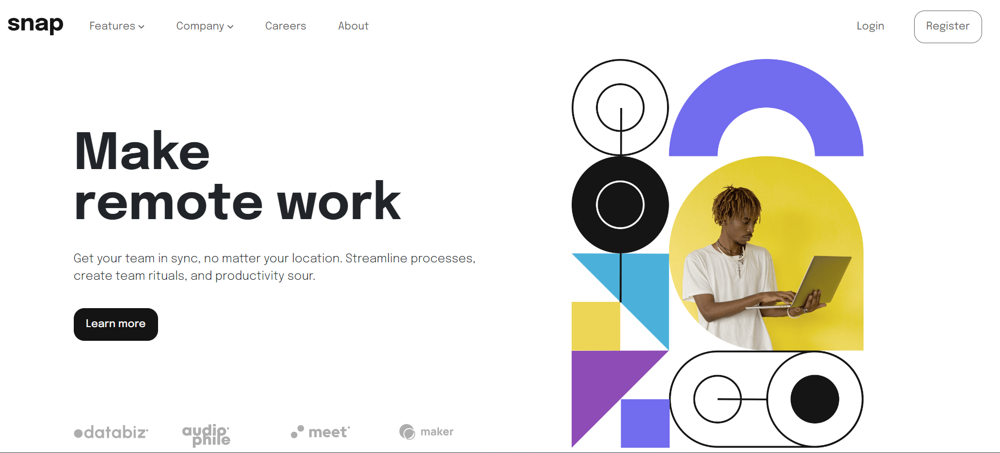

# Frontend Mentor - Intro section with dropdown navigation solution

This is a solution to the [Intro section with dropdown navigation challenge on Frontend Mentor](https://www.frontendmentor.io/challenges/intro-section-with-dropdown-navigation-ryaPetHE5). Frontend Mentor challenges help you improve your coding skills by building realistic projects. 

## Table of contents

- [Frontend Mentor - Intro section with dropdown navigation solution](#frontend-mentor---intro-section-with-dropdown-navigation-solution)
  - [Table of contents](#table-of-contents)
  - [Overview](#overview)
    - [The challenge](#the-challenge)
    - [Screenshot](#screenshot)
    - [Links](#links)
  - [My process](#my-process)
    - [Built with](#built-with)
    - [What I learned](#what-i-learned)
    - [Continued development](#continued-development)
  - [Author](#author)

## Overview

### The challenge

Users should be able to:

- View the relevant dropdown menus on desktop and mobile when interacting with the navigation links
- View the optimal layout for the content depending on their device's screen size
- See hover states for all interactive elements on the page

### Screenshot

### Links

- Solution URL: [Frontend Mentor](https://www.frontendmentor.io/solutions/responsive-intro-section-with-bootstrap-and-jquery-S9OrAe2hOk
)
- Live Site URL: [Vercel](https://intro-section-with-dropdown-navigation-swart.vercel.app/)

## My process

### Built with

- Semantic HTML5 markup
- CSS custom properties
- Flexbox
- CSS Grid
- Mobile-first workflow
- [JQuery](https://jquery.com/) - JS library
- [Bootstrap 5](https://getbootstrap.com/) - For styles and responsiveness

### What I learned

I learned how to maintain fluid typography in the UI when designing the intro section with dropdown navigation, ensuring that the text scales gracefully across different screen sizes, and providing a seamless user experience on a wide range of devices.

### Continued development

I want to explore more intuitive layouts for different sections of the UI, focusing on creating designs that not only look visually appealing but also enhance user interaction and navigation, ultimately improving the overall usability and user experience of the interface

## Author

- Frontend Mentor - [@keithufumeli](https://www.frontendmentor.io/profile/keith-ufuumeli)
- Twitter - [@KUfumeli](https://www.twitter.com/KUfumeli)

